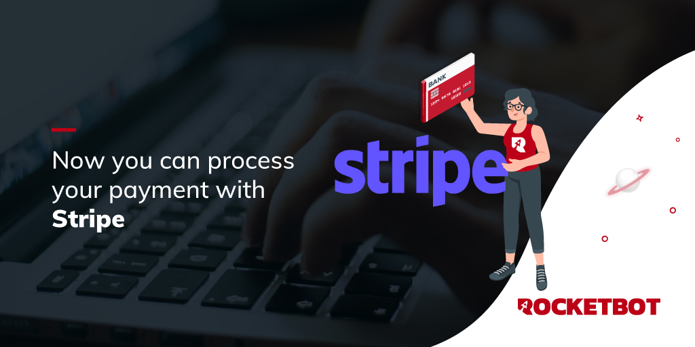

# Stripe
  
Modulo para trabajar con Stripe Invoice  

*Read this in other languages: [English](Manual_Stripe.md), [Español](Manual_Stripe.es.md).*
  

## Como instalar este módulo
  
__Descarga__ e __instala__ el contenido en la carpeta 'modules' en la ruta de Rocketbot.  

## Descripción de los comandos

### Acceso
  
Ingrese el ID de cliente del token nuevo y el secreto del cliente para obtener el token de acceso
|Parámetros|Descripción|ejemplo|
| --- | --- | --- |
|Identificación del cliente|ID del cliente del token nuevo|ID|

### Crear Factura
  
Crea una factura para el cliente
|Parámetros|Descripción|ejemplo|
| --- | --- | --- |
|Días hasta el vencimiento|Días que tiene el cliente para pagar la factura|1-1-2030|

### Enviar factura
  
Enviar factura al cliente
|Parámetros|Descripción|ejemplo|
| --- | --- | --- |

### Añadir artículo
  
Agregar un artículo a la factura
|Parámetros|Descripción|ejemplo|
| --- | --- | --- |
|Nombre del árticulo|Nombre del árticulo que se agregará a la factura|art 1|
|Precio|Precio del árticulo que se agregará a la factura|200|
|Cantidad|Cantidad del árticulo que se agregará a la factura|5|
|Divisa|Divisa de la factura|currency|

### Agregar cliente
  
Agregar un destinatario a la factura
|Parámetros|Descripción|ejemplo|
| --- | --- | --- |
|Nombre del cliente|Nombre del cliente que se agregará a la factura|John Doe|
|Correo electrónico|Correo electrónico del cliente que se agregará a la factura|johndoe@mail.com|
|Dirección 1|Dirección 1 del cliente|Av. Siempre viva|
|Dirección 2|Dirección 2 del cliente|742|
|Ciudad|Ciudad del cliente|Springfield|
|País|País del cliente|United States|
|Estado|Estado del cliente|Oregon|
|Código postal|Código postal del cliente|1234|
|Teléfono|Teléfono del cliente|4155550123|
