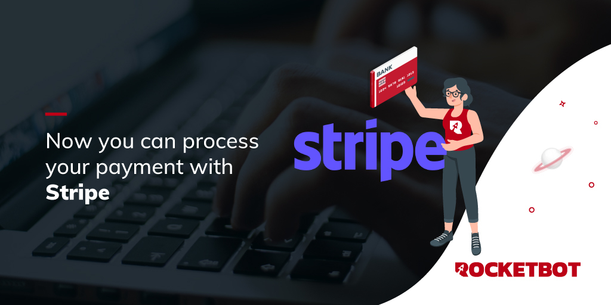

# Stripe
  
Module for working with Stripe Invoice  

*Read this in other languages: [English](Manual_Stripe.md), [Español](Manual_Stripe.es.md).*
  

## How to install this module
  
__Download__ and __install__ the content in 'modules' folder in Rocketbot path  

## Description of the commands

### Login
  
Input the fresh token client id and client secret to get the access token
|Parameters|Description|example|
| --- | --- | --- |
|client id|client ID of the new token|ID|

### Create Invoice
  
Create an invoice for the customer
|Parameters|Description|example|
| --- | --- | --- |
|Days Till Due|Days the customer has to pay the invoice|1-1-2030|

### Send Invoice
  
Send invoice to the customer
|Parameters|Description|example|
| --- | --- | --- |

### Add Item
  
Add an item to the invoice
|Parameters|Description|example|
| --- | --- | --- |
|Item Name|Name of the item that will be added to the invoice|item 1|
|Price|Price of the item that will be added to the invoice|200|
|Quantity|Quantity of the item that will be added to the invoice|5|
|Currency|Currency of the invoice|currency|

### Add Customer
  
Add a recipient to the invoice
|Parameters|Description|example|
| --- | --- | --- |
|Customer Name|Customer name that will be added to the invoice|John Doe|
|Email|Customer email that will be added to the invoice|johndoe@mail.com|
|Address Line 1|Customer address line 1|Av. Evergreen|
|Address Line 2|Customer address line 2|742|
|City|Customer city|Springfield|
|Country|Customer country|United States|
|State|Customer state|Oregon|
|Postal Code|Customer postal code|1234|
|Phone|Customer phone|4155550123|
